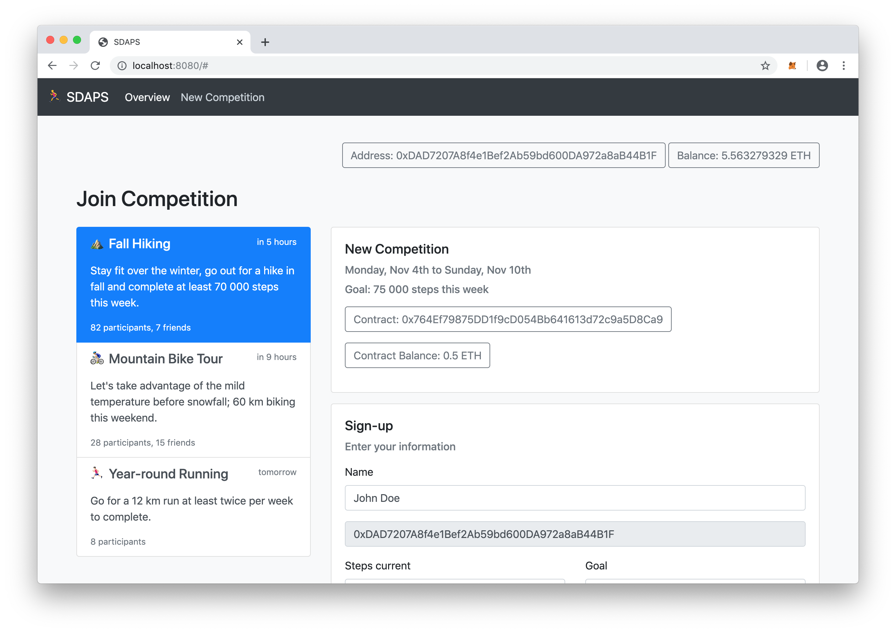
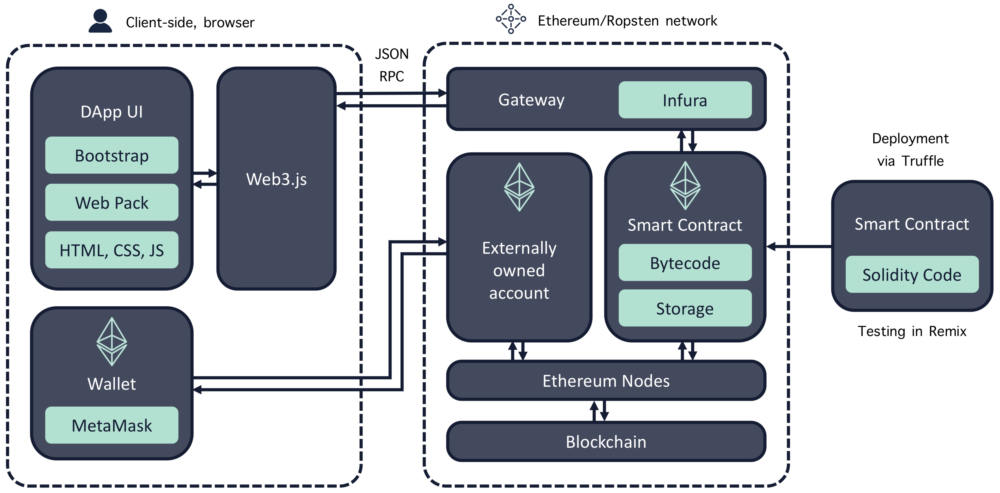

# Steps dApp

Decentralized application (dApp) powered by the Ethereum blockchain that rewards users for being active. Users can set challenging goals ("do 70 000 steps in the upcoming week"), place monetary incentives, and compete among strangers.

The app should then record the user's progress to achieve the goal. A potential source to track the user's steps in real-time are health services like Google Fit and Apple Health.

The smart contract is written in Solidity and was initially tested in the Remix environment. The contract implements the logic of a competition. 

The user interface is built with Bootstrap components. Web3.js allows the front-end to interact, read and write data, from smart contracts on the Ethereum network via HTTP. Required modules are bundles using Webpack.

A user needs to install [Metamask](https://metamask.io/) which is a Browser extension available for Chrome and Firefox serving as an Ether wallet. With MetaMask, users can connect to Ethereum or a test network without running a full node on the browser's machine. You can get free Ether for testing only on [faucets](https://faucet.ropsten.be/).

The initial testing of the app was done with Ganach which fires up a personal local Ethereum blockchain. For further testing, the smart contract was deployed to the Ropsten test network. The deployment works via Truffle.

After developing the front-end interactions with Web3.js and deploying the contract to a network, both were connected through Infura. Infura is a development suite that provides API access to the Ethereum and test networks. With this setup, one can interact with a smart contract without running an actual node.

## Setup

- First, migrate contract and deploy on Ropsten network
  - `truffle develop` to start local blockchain
  - `migrate --reset` to deploy smart contract
  - `migrate --reset --network ropsten` to deploy smart contract on Ropsten
- With contract migrated, run local 
  - `npm install`
  - `npm start`
  
  

## File Structure

- build/contracts/
  - `Compete.json`
  - `Migrations.json`
- client/
  - `index.js`
- contracts/
  - `Compete.sol`
  - `Migrations.sol`
- migrations/
  - `1_initial_migration.js`
  - `2_compete.js`
- public/
  - `index.html`
- `package-lock.json`
- `package.json`
- `truffle-config.js`
- `webpack.config.js`
